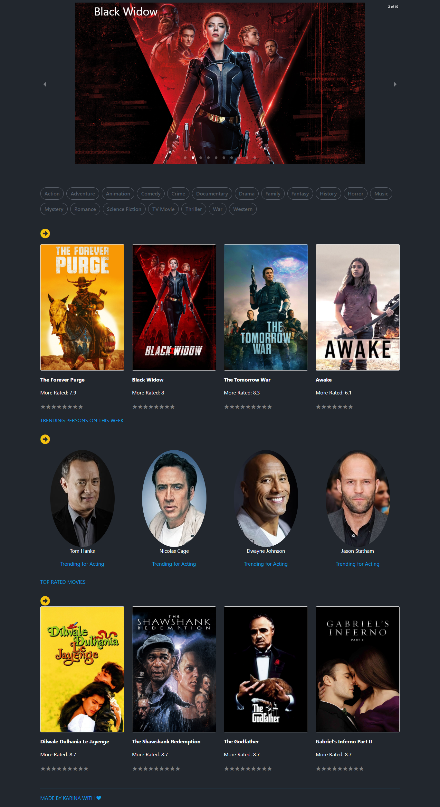

# POPCORN MANIA 🍿

This project was bootstrapped with [Create React App](https://github.com/facebook/create-react-app).
 
Is the final project of the Frontend web development training at ADA ITW

## SOME USEFUL TECHNOLOGIES

- JavaScript
- Bootstrap
- Axios
- React-router-dom
- React player

## API
- [TMBD](https://www.themoviedb.org/)

## COURTESY
I'm a trainee Developer. I have a long way to go in order to improve the quality of my code and any feedback will be well received

## This is the cover of the app 🎬

🖱 [Click too see](https://amazing-shirley-75d411.netlify.app/)

